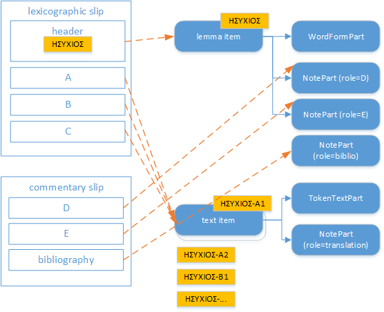

# PURA Models

You can also have a glance at the [graphical overview](overview.md).

Legenda: in the following documentation, each data model is represented by a named object with any number of properties. Each property can either be a scalar ("simple") property, like a number, a text (string), a boolean (=yes/no) value, etc. Properties can freely nest.

The following conventions apply:

- required properties are marked by an asterisk.
- each property has a data type expressed in `()`.
- properties representing a list have their data type suffixed with `[]`.
- text (string) properties marked with `thesaurus` have their value picked from a predefined taxonomy.
- text (string) properties marked with MD represent a text with basic formatting (e.g. bold, italic, etc.), rather than a plain text with no formatting at all (which is the default).

## Items

In this project there are 4 types of items:

- lemmata: a sort of specialized dictionary.
- text with layers: Greek text passages cited in the discussion.
- manuscripts: codicological descriptions.
- articles: monographic treatises about general themes.

Each of these items has a number of parts:

- lemma
  - `WordFormsPart` (PURA)
  - `CategoriesPart`
  - `IndexKeywordsPart`
  - `CommentPart`
  - `BibliographyPart`

- text
  - `TokenTextPart`
  - `NotePart`
  - `CategoriesPart`
  - `IndexKeywordsPart`
  - `BibliographyPart`
  - `ApparatusLayerFragment`
  - `CommentLayerFragment`
  - `LingTagsLayerFragment` (TGR)
  - `LemmaTagLayerFragment` (PURA)

- manuscript
  - `CategoriesPart`
  - `HistoricalDatePart`
  - `NotePart`
  - `BibliographyPart`
  - `MsSignaturesPart` (ITINERA)
  - `MsPlacesPart` (TGR)
  - `MsContentsPart` (TGR)
  - `MsUnitsPart` (TGR)
  - `MsScriptsPart` (TGR)
  - `MsOrnamentsPart` (TGR)
  - `MsHistoryPart` (TGR)

- article
  - `NotePart`
  - `CategoriesPart`
  - `IndexKeywordsPart`
  - `BibliographyPart`

Given that the project was born document-based, this picture shows the essential mapping between the original documents and the target structure:

## Lemma Item

Each lemma item has a title starting with its first lemma LID (e.g. `ΗΣΥΧΙΟΣ`) followed by space and any other heading text.

- `WordFormsPart`\*:
  - `forms` (`WordForm[]`):
    - `lid` (`string`): lexicographic ID (LID for short). In the case of this project, it's just the uppercase lemma without diacritics.
    - `prelemma` (`string`)
    - `lemma`\* (`string`)
    - `postlemma` (`string`)
    - `homograph` (`integer`)
    - `pos`\* (`string`, thesaurus): part of speech.
    - `note` (`string`): optional short note.
    - `variants` (`VariantForm[]`): variants or other inflected forms related to this form:
      - `value`\* (`string`)
      - `tag` (`string`)

Occasionally, the lemma can also consist in a syntactic pattern. In this case, `pos` will have a special value encoding the pattern, and lemma will be represented by a string where each tag is an uppercase abbreviation prefixed with `/`, and can be applied to specific words, or syntactic constituents, included between square brackets. For instance, we might have `[ἔχω/V /ADV]/VP` representing a verbal phrase (`/VP`) built from the verb (`/V`) `ἔχω` plus an unspecified adverb (`/ADV`) to mean a state.

- `CategoriesPart`: [categories](https://github.com/vedph/cadmus_doc/blob/master/web/help/general-parts.md#categories) assigned to the lemma. These will draw data from a hierarchical taxonomy.

- `IndexKeywordsPart`: [keywords](https://github.com/vedph/cadmus_doc/blob/master/web/help/general-parts.md#index-keywords) eventually assigned to the lemma.

- `CommentPart`:

  - `tag` (`string`): any tag useful to categorize the comment (e.g. scholarly, explanatory, etc.).
  - `text`\* (`string`, MD): the comment's text.
  - `sources` (`DocReference[]`): [sources](https://github.com/vedph/cadmus_itinera_doc/blob/master/help/doc-references.md):
    - `tag`
    - `author`
    - `work`
    - `location`
    - `note`
  - `externalIds` (`string[]`): [external IDs](https://github.com/vedph/cadmus_itinera_doc/blob/master/help/external-ids.md) of any sort (LOD IDs, link to a webpage or other resource, etc.).

- `BibliographyPart`: general [bibliography](https://github.com/vedph/cadmus_doc/blob/master/web/help/general-parts.md#bibliography).

## Text Item

These are simple passages extracted from various works, and referenced in the discussions. Each item has its group ID equal to the work (e.g. `antiatt`), and its title equal to the LID of the main lemma (e.g. `ΗΣΥΧΙΟΣ` from `ἡσύχιος`), followed by a dash and the passage local ID (e.g. `-A1`).

- `TokenTextPart`\*: [text passage](https://github.com/vedph/cadmus_doc/blob/master/web/help/general-parts.md#token-text).

- [NotePart](https://github.com/vedph/cadmus_doc/blob/master/web/help/general-parts.md#note) for translation, with `role`=`transl` (`NotePart`).

- `CategoriesPart`: [categories](https://github.com/vedph/cadmus_doc/blob/master/web/help/general-parts.md#categories) assigned to the text passage. These will draw data from a hierarchical taxonomy.

- `IndexKeywordsPart`: [keywords](https://github.com/vedph/cadmus_doc/blob/master/web/help/general-parts.md#index-keywords) eventually assigned to the lemma.

- `BibliographyPart`: general [bibliography](https://github.com/vedph/cadmus_doc/blob/master/web/help/general-parts.md#bibliography).

- `ApparatusLayerFragment`: [apparatus layer](https://github.com/vedph/cadmus_doc/blob/master/web/help/philology-parts.md#apparatus).

- `CommentLayerFragment`: comments layer. Each comment fragment has the same model as `CommentPart`.

- `LingTagsLayerFragment`: [linguistic tags layer](https://github.com/vedph/cadmus_tgr_doc/blob/master/models.md#lingtagslayerfragment).

- `LemmaTagLayerFragment`: lemmata layer: this annotates the reference lemma for a specific portion of the text passage:
  - `tag` (`string`)
  - `value`\* (`string`)
  - `normValue`\* (`string`)

## Manuscript Item

- `BibliographyPart`: general [bibliography](https://github.com/vedph/cadmus_doc/blob/master/web/help/general-parts.md#bibliography).

See [TGR](https://github.com/vedph/cadmus_tgr_doc/blob/master/models.md).

## Article Item

- `NotePart`: the article. A generic [note](https://github.com/vedph/cadmus_doc/blob/master/web/help/general-parts.md#note) can be used here, as its model just includes a tag and a MD text. The MD text also includes a minimalist tagging for:

  - references to ancient authors (`{ra:...}`)
  - references to modern authors (`{rm:...}`)
  - references to text passages (`{rt:...}`)
  - manuscripts (`{m:...}`)
  - literals (`{l:...}`)

These minimal tags can be introduced in texts created with any word processor, as this is a content creation scenario to be included.

- `CategoriesPart`: [categories](https://github.com/vedph/cadmus_doc/blob/master/web/help/general-parts.md#categories) assigned to the article. These will draw data from a hierarchical taxonomy.

- `IndexKeywordsPart`: [keywords](https://github.com/vedph/cadmus_doc/blob/master/web/help/general-parts.md#index-keywords) eventually assigned to the article.

- `BibliographyPart`: general [bibliography](https://github.com/vedph/cadmus_doc/blob/master/web/help/general-parts.md#bibliography).
