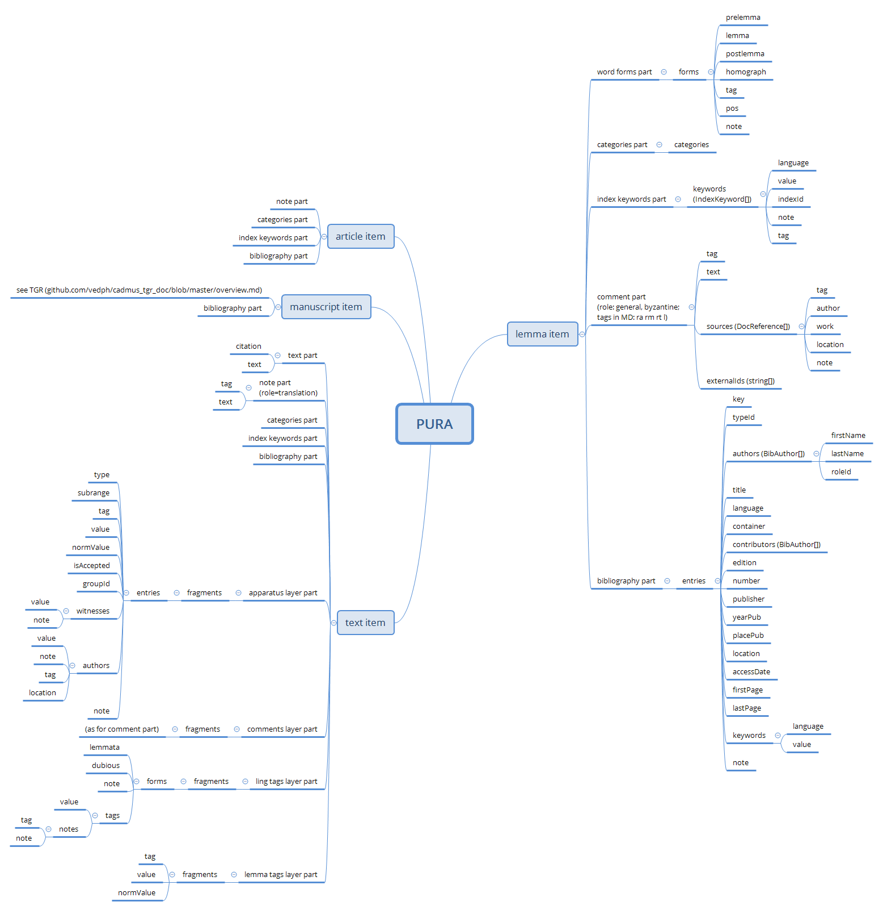

# PURA Models

Legenda: in the following documentation, each data model is represented by a named object with any number of properties. Each property can either be a scalar ("simple") property, like a number, a text (string), a boolean (=yes/no) value, etc. Properties can freely nest.

The following conventions apply:

- required properties are marked by an asterisk.
- each property has a data type expressed in `()`.
- properties representing a list have their data type suffixed with `[]`.
- text (string) properties marked with `thesaurus` have their value picked from a predefined taxonomy.
- text (string) properties marked with MD represent a text with basic formatting (e.g. bold, italic, etc.), rather than a plain text with no formatting at all (which is the default).

## Items

In this project there are 5 types of items:

- lemmata: a sort of specialized dictionary.
- text with layers: Greek texts.
- translations with layers: English translations.
- manuscripts: codicological descriptions.
- articles: monographic treatises about general themes.

## Lemma Item

- `LemmaPart`\*:
  - `lemma`\* (`string`): lemma.
  - `normLemma`\* (`string`): normalized form of the lemma.
  - `pos`\* (`string`, thesaurus): part of speech.
  - `note` (`string`): optional short note.

- `CategoriesPart`: [categories](https://github.com/vedph/cadmus_doc/blob/master/web/help/general-parts.md#categories) assigned to the lemma. These will draw data from a hierarchical taxonomy.

- `IndexKeywordsPart`: [keywords](https://github.com/vedph/cadmus_doc/blob/master/web/help/general-parts.md#index-keywords) eventually assigned to the lemma.

- `CommentPart`:
  - `tag` (`string`): any tag useful to categorize the comment (e.g. scholarly, explanatory, etc.).
  - `text`\* (`string`, MD): the comment's text.
  - `sources` (`DocReference[]`): [sources](https://github.com/vedph/cadmus_itinera_doc/blob/master/help/doc-references.md) citations.
  - `externalIds` (`string[]`): [external IDs](https://github.com/vedph/cadmus_itinera_doc/blob/master/help/external-ids.md) of any sort (LOD IDs, link to a webpage or other resource, etc.).

- `BibliographyPart`: general [bibliography](https://github.com/vedph/cadmus_doc/blob/master/web/help/general-parts.md#bibliography).

## Text Item

- `TokenTextPart`\*: [text passage](https://github.com/vedph/cadmus_doc/blob/master/web/help/general-parts.md#token-text).

- `CategoriesPart`: [categories](https://github.com/vedph/cadmus_doc/blob/master/web/help/general-parts.md#categories) assigned to the text passage. These will draw data from a hierarchical taxonomy.

- `IndexKeywordsPart`: [keywords](https://github.com/vedph/cadmus_doc/blob/master/web/help/general-parts.md#index-keywords) eventually assigned to the lemma.

- `ApparatusLayerFragment`: [apparatus layer](https://github.com/vedph/cadmus_doc/blob/master/web/help/philology-parts.md#apparatus).

- `CommentLayerFragment`: comments layer. Each comment fragment has the same model as `CommentPart`.

- `LingTagsLayerFragment`: [linguistic tags layer](https://github.com/vedph/cadmus_tgr_doc/blob/master/models.md#lingtagslayerfragment).

- `LemmaTagsLayerFragment`: lemmata layer: this annotates the reference lemma for a specific portion of the text passage:
  - `tag` (`string`)
  - `value`\* (`string`)
  - `normValue`\* (`string`)

- `BibliographyPart`: general [bibliography](https://github.com/vedph/cadmus_doc/blob/master/web/help/general-parts.md#bibliography).

## Translation Item

- `TokenTextPart`: translation of a [text passage](https://github.com/vedph/cadmus_doc/blob/master/web/help/general-parts.md#token-text). The source passage is identified by virtue of its citation.

- `CategoriesPart`: [categories](https://github.com/vedph/cadmus_doc/blob/master/web/help/general-parts.md#categories) assigned to the text passage. These will draw data from a hierarchical taxonomy.

- `IndexKeywordsPart`: [keywords](https://github.com/vedph/cadmus_doc/blob/master/web/help/general-parts.md#index-keywords) eventually assigned to the translation.

- `LemmaTagsLayerFragment`: as above, for the corresponding translated term(s).

## Manuscript Item

TODO: pick from [TGR](https://github.com/vedph/cadmus_tgr_doc/blob/master/models.md) / [Itinera](https://github.com/vedph/cadmus_itinera_doc/blob/master/models.md).

- `BibliographyPart`: general [bibliography](https://github.com/vedph/cadmus_doc/blob/master/web/help/general-parts.md#bibliography).

## Article Item

- `NotePart`: the article. A generic [note](https://github.com/vedph/cadmus_doc/blob/master/web/help/general-parts.md#note) can be used here, as its model just includes a tag and a MD text.

- `CategoriesPart`: [categories](https://github.com/vedph/cadmus_doc/blob/master/web/help/general-parts.md#categories) assigned to the article. These will draw data from a hierarchical taxonomy.

- `IndexKeywordsPart`: [keywords](https://github.com/vedph/cadmus_doc/blob/master/web/help/general-parts.md#index-keywords) eventually assigned to the article.

- `BibliographyPart`: general [bibliography](https://github.com/vedph/cadmus_doc/blob/master/web/help/general-parts.md#bibliography).
